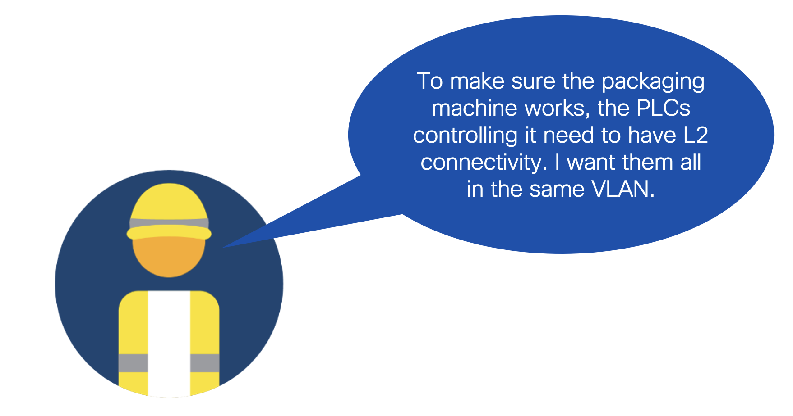

# Module 1: Use RESTCONF to manage VLANs on your devices

In this module, you will use device-level APIs to manage your network device. Specifically, you will learn how to manage (see/create/delete) the VLANs configured on your device. This could for instance be interesting when devices need L2 connectivity on your factory floor, across different network devices. 



## Set-up

1. Switch to this folder in your terminal.

```
$ cd 01-restconf
```

> [!TIP]
> If you are not planning to use a real network device, change to the `dummy_scripts` directory and skip right to the `Instructions` part of these steps.

2. Install the Python libraries required.

```
$ pip3 install -r requirements.txt
```

3. Fill out the `.env` file with your device's variables.

```
DEVICE_IP=<your-device-ip> # Make sure this IP is reachable by the device executing these scripts!
USERNAME=<your-device-username>
PASSWORD=<your-device-password>
```

## Instructions

1. In one terminal, run the `get_vlans.py` script. Every 2 seconds, will print out the VLANs configured on your device.

```
$ python3 get_vlans.py
```

```
# An example output could look like this: 
------------------
1: This is my first VLAN
2: This is my second VLAN
3: This is my third VLAN
------------------
1: This is my first VLAN
2: This is my second VLAN
3: This is my third VLAN
------------------
1: This is my first VLAN
2: This is my second VLAN
3: This is my third VLAN
...
```

2. In another terminal, run the `set_vlan.py` script. It will request you for a VLAN number and description and then create the corresponding VLAN on your network device. In the output of the `get_vlans.py` script, you will see this VLAN appear. 

```
$ python3 set_vlan.py
```

```
# Now, the example output could look like this: 
------------------
1: This is my first VLAN
2: This is my second VLAN
3: This is my third VLAN
------------------
1: This is my first VLAN
2: This is my second VLAN
3: This is my third VLAN
4: This is my fourth VLAN
------------------
1: This is my first VLAN
2: This is my second VLAN
3: This is my third VLAN
4: This is my fourth VLAN
...
```

3. Now run the `delete_vlan.py` script to delete the VLAN you just created. You will see its number get deleted from the output of the `get_vlans.py` script.

> [!NOTE]  
> Note that this script does use the `netmiko` library to delete VLANs over SSH. This is not because we cannot do this operation over RESTCONf, but just to show the art of the possible :)

```
$ python3 delete_vlan.py
```

```
# Now, the example output could look like this: 
------------------
1: This is my first VLAN
2: This is my second VLAN
3: This is my third VLAN
4: This is my fourth VLAN
------------------
1: This is my first VLAN
2: This is my second VLAN
3: This is my third VLAN
------------------
1: This is my first VLAN
2: This is my second VLAN
3: This is my third VLAN
...
```
