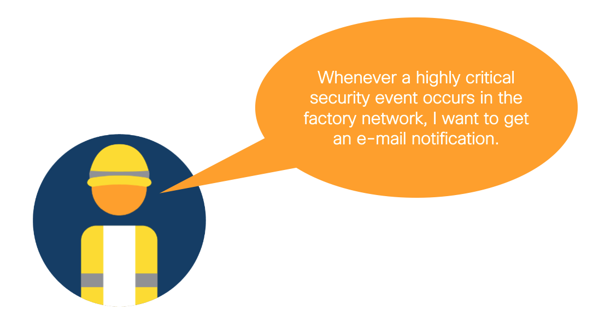

# Module 3: Use Cyber Vision to get alerted on critical security events in your industrial network.

In this module, you will use Cisco Cyber Vision APIs to keep track of the high-critical security events in your network. Specifically, you will learn how to receive an e-mail alert about events seen by Cyber Vision. This could for instance be interesting when you want to keep an extra eye on the most critical part of your industrial network. Starting from this code, you can be as specific as you want in the type of event you want to be alerted on, or which devices need to be involved.



## Set-up

> [!TIP]
> If you are not planning to use a real network device, change to the `dummy_scripts` directory.

1. Switch to this folder in your terminal.

```
$ cd 03-cybervision
```

2. Install the Python libraries required.

```
$ pip3 install -r requirements.txt
```

3. Fill out the `.env` file with your device's variables. As this script uses GMail as its SMTP server, make sure you have an e-mail address on there, and an app password configured ([here](https://support.google.com/accounts/answer/185833?hl=en) you can learn how to do that). The API token for Cyber Vision can be generated under `Admin > API > Token` in the Cyber Vision console.

```
SMTP_HOST=smtp.gmail.com
SMTP_USERNAME=<your-gmail-address>
SMTP_PASS=<your-gmail-app-password>
SMTP_FROM=<your-gmail-address>
SMTP_TO=<your-gmail-address>
```

## Instructions

1. In a terminal, run the `main.py` script. 

```
$ python3 main.py
```

2. Now, check your GMail inbox for an e-mail informing you about your Cyber Vision security events.
