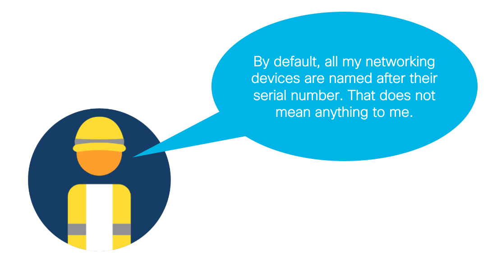

# Module 4: Use IOT Operations Dashboard to give your devices a meaningful name.

In this module, you will use Cisco IoT Operations Dashboard APIs to make the management of your network more friendly to a process-focuesed OT persona. Specifically, you will learn how to easily set the names of your devices to something usable. This could for instance be interesting when you want to make more sense of any operational events happening, as they get linked to a name that actually means something to a factory floor worker, instead of a complicated serial number.



## Set-up

> [!TIP]
> If you are not planning to use a real network device, change to the `dummy_scripts` directory.

1. Switch to this folder in your terminal.

```
$ cd 04-iotod
```

2. Install the Python libraries required.

```
$ pip3 install -r requirements.txt
```

3. Fill out the `.env` file with your device's variables. You can generate the `API_SECRET` and `CLIENT_ID` from IoT Operations Dashboard, using [these](https://developer.cisco.com/docs/iotod/edm/#!authentication/authentication) instructions. Your `DEVICE_EID` is constructed of its product ID + serial number. For example, it could be: `IR1101-K9+FCW23XXXXX` for an IR1101 with serial number FCW23XXXXX.

```
API_SECRET=<your-api-secret>
TENANT_ID=<your-iotod-tenant-id>
DEVICE_EID=<your-device-eid>
TENANT_NAME=<your-iotod-tenant-name>
CLIENT_ID=<your-api-client-id>
```

## Instructions

1. In one terminal, run the `main.py` script. 

```
$ python3 main.py
```

2. The script will prompt you for a new device name to configure:

```
Enter a new name for your device: 
```

3. Enter a new name, press `Enter` and this message should show you the script executed succesfully:

```
Succesfully updated device name!
```

4. In IoT Operations Dashboard, the device should now have a new name.